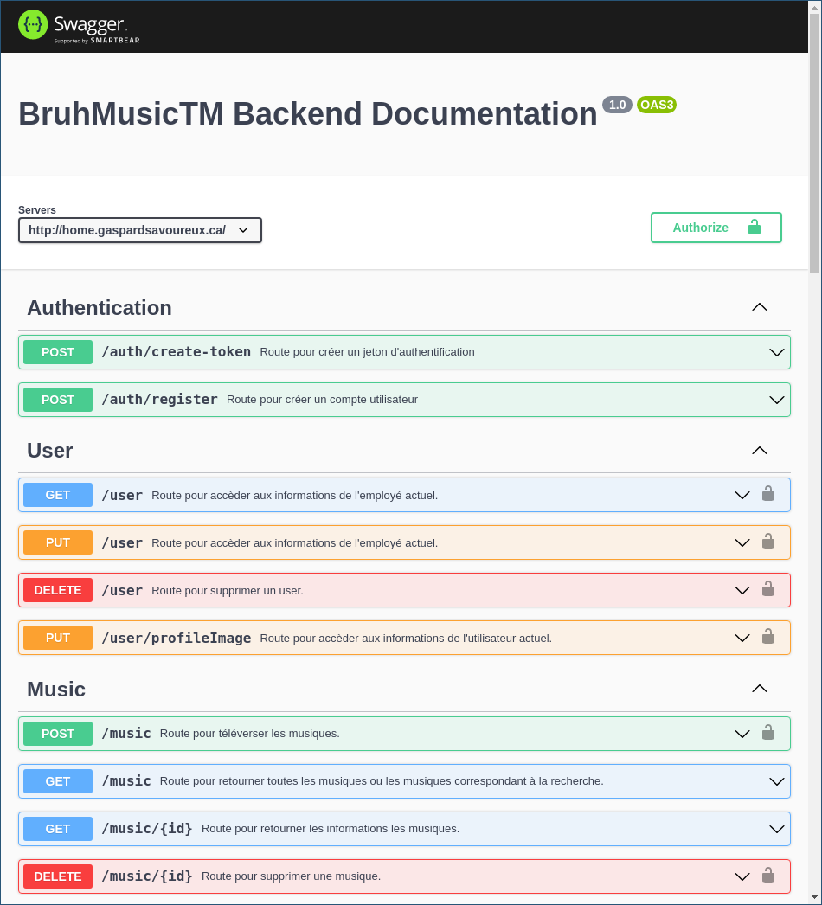

<h1 align="center"> <i><b> ~ BruhMusicTMBackend ~ </i></b></h1>



# Installation
```
git clone https://github.com/Gaspard-Savoureux/BruhMusicTMBackend.git 
&& cd BruhMusicTMBackend 
&& npm install
&& mkdir public/uploads -p
```
# Préparation
1. importer **cleanDBTemplate.sql** dans une base de données pour avoir une base de données *contenant uniquement la structure de celle-ci*.

> Si vous voulez une bases de données déjà peuplé vous pouvez importer **exportedDB.sql**. À noter qu'elle les images ne seront pas visibles.


2. créé un fichier .env contenant les informations de votre base de données tel quelle:
```
DB_HOST=	example: localhost
DB_USERNAME= example: chadTM
DB_PASSWORD= example: motDePasseMaxiDélice
DB_DATABASE= example: bruhMusicTM
SECRET=  example: aiodfhj97812y3h.213c132u3h
``` 
# Lancer
entrer dans un terminal à la racine du projet:
```
node index.js
```
la documentation devrait être disponible à :
```
http://localhost:3000/doc/#/
```
vous pouvez faire vos requêtes à l'adresse:
```
http://localhost:3000/
```